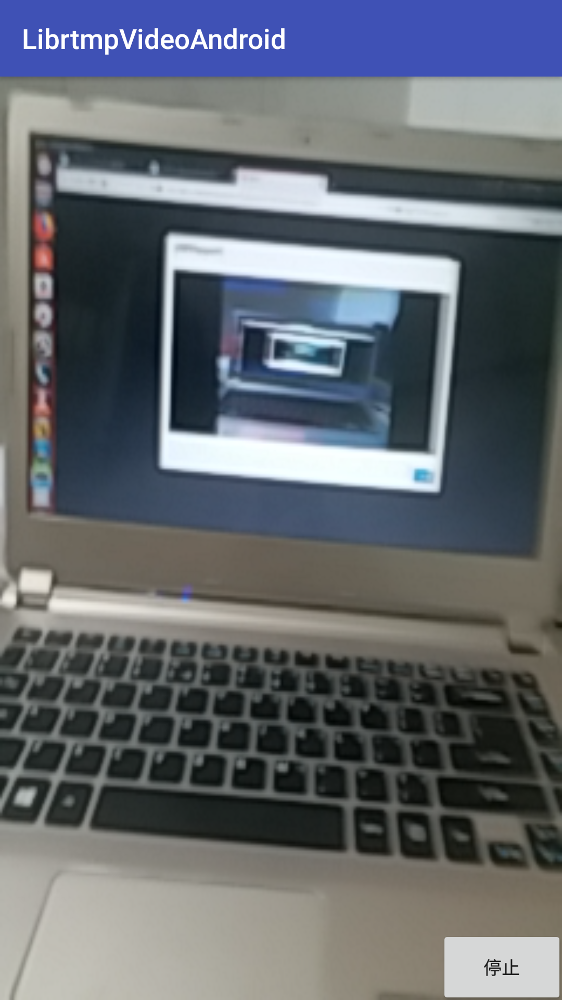
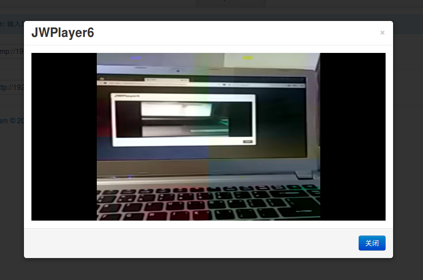

Android平台上使用Camera和AudioRecord采集音视频数据，通过MediaCodec对音视频实施硬编码，移植rtmpdump开源库通过Rtmp协议将音视频数据发送到流媒体服务器的直播方案 

使用到的api \
    音视频采集用到的api有：Camera、AudioRecord \
    编码用的是系统提供的API:MediaCodec (硬编码) \
    推送使用的开源库:librtmp
  
 将AVC(h264)和AAC数据推送到srs流媒体服务器。实现方法是： \
   1、使用android自带的API采集摄像头数据 \
   2、使用AudioRecord采集音频数据 \
   3、使用MediaCodec对视频和音频分别进行硬编码为H264码流和AAC码流 \
   4、然后使用ndk开发将编码后的数据通过librtmp发送出去

编译步骤： \
   安装ndk版本至少是r14 \
   1 环境变量ANDROID_NDK_ROOT设置到PAHT中 \
   2 cd jni/rtmpvedio/polarssl-1.2.14/ \
     执行armeabi_or_v7a_build.sh脚本 \
   3 cd jni/ \
     执行ndk-build clean \
     执行ndk-build

运行步骤：\
   1 将MainActivity.java中IP地址192.168.1.101改为srs服务器所在的IP,android客户端ip和srs服务器在同一网络 \
   2 下载srs服务器代码 \
   3 cd srs/trunk \
   4 bash scripts/build.sh \
   5 bash scripts/run.sh \
   6 火狐浏览器打开srs网页客户端 如 http://192.168.1.101:8085 \
   7 在srs网页客户端rtmp地址栏中输入rtmp://192.168.1.101:1935/zhongjihao/myh264 \
   8 最后用AndroidStudio编译运行apk，点击开始即可在srs网页客户端上看到android客户端推送过来的视频 \
   9 bash scripts/stop.sh 结束srs服务器运行
   
推送端: 三星C9上运行截图如下

接收端: Srs流媒体客户端播放截图如下

接收端: Vlc客户端播放截图如下

